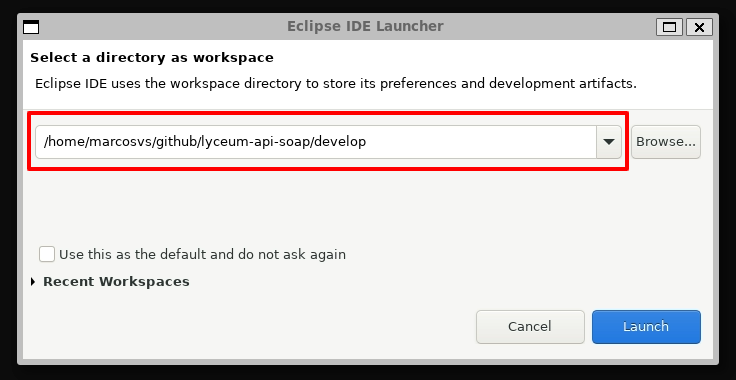
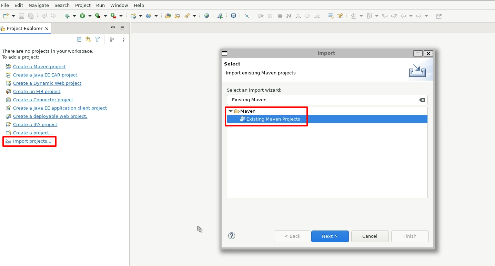
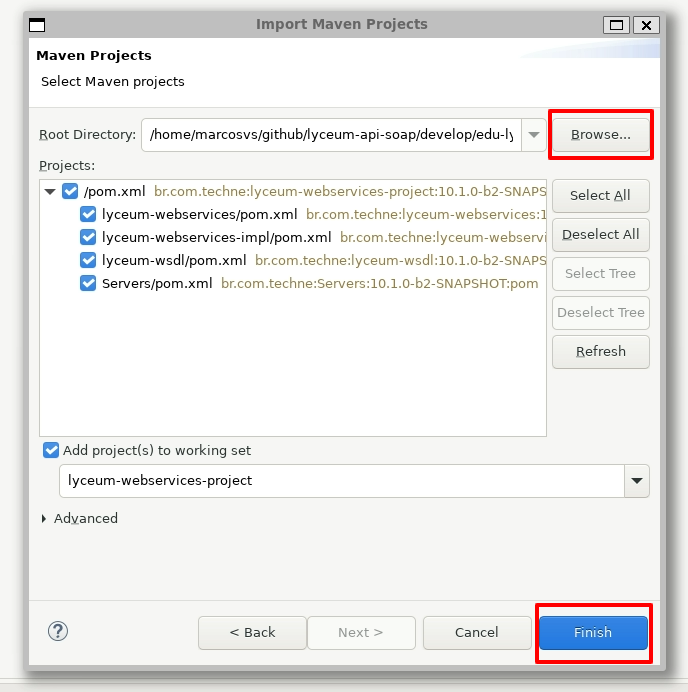
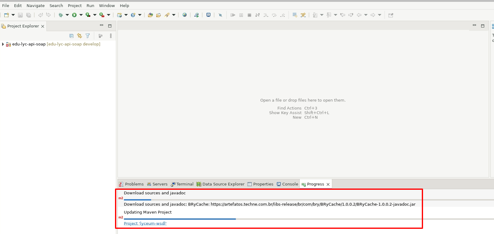
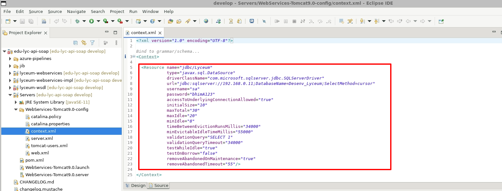
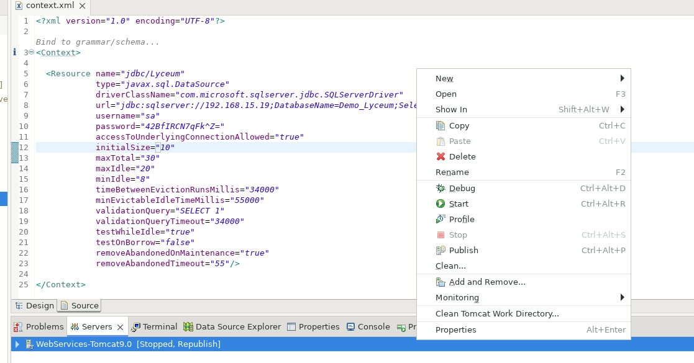
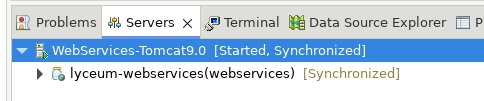
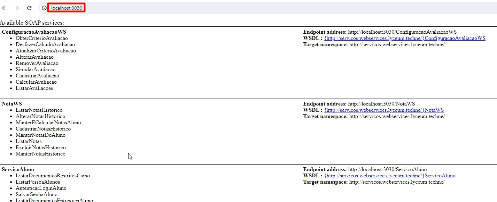

## :zap: Preparando edu-lyc-api-soap

##### 1.1 - Clone o projeto edu-lyc-api-soap

Entre no repostório [edu-lyc-api-soap](https://github.com/technecloud/edu-lyc-api-soap) e faça o clone do projeto a partir da branch develop. Lembre-se de clonar esse projeto na pasta `~/github/lyceum-api-soap/develop` citada anteriormente.

##### 1.2 - Execute o build do projeto usando o Maven

Dentro do terminal, vá até o diretório onde você realizou o clone do projeto e execute o comando:
```
./mvnw clean install -U
```
Caso ocorra o seguinte erro durante a execução do comando:
\
Execute o comando abaixo e tente novamente:
```
chmod +x mvnw
```
Aguarde até que a build mostre a mensagem de sucesso. (*A primeira execução costuma demorar um pouco para ser completada*)

##### 1.3 - Abrindo o projeto no Eclipse

Abra seu eclipse, mas na seleção de *workspaces* lembre-se de selecionar a pasta `~/github/lyceum-api-soap/develop`.



Durante a primeira execução, seu workspace virá vazio, realize a importação do projeto acessando `File > Import Project` e selecionando a opção **Existing Maven Projects**.



Logo após a importação, o Eclipse irá iniciar o processo de *build* do projeto. Aguarde até que a operação seja concluída. (Esta etapa pode demorar alguns minutos)



##### 1.4 - Inicializando o projeto no Tomcat

Depois que a importação do projeto for concluída, a primeira etapa para a preparação da subida da aplicação no Tomcat é verificação das configurações no banco de dados. Estas configurações ficam dentro da pasta *Servers > WebServices-Tomcat9.0-config*.



Como podemos ver na figura acima, o *context.xml* tem a configuração do banco de dados que será usado na aplicação. Certifique-se de que as informações de **url**, **username** e **password** estão corretas.

Agora podemos então iniciar a aplicação. Para tal, abra a aba *Servers*, selecione o servidor já configurado **WebServices-Tomcat-9.0** com o botão direto e execute na sequência:

- **Clean Tomcat Work Directory** (limpa o diretorio de aplicações do servidor)
- **Clean...** (limpa e republica o pacote .war no servidor)
- **Start** (inicia o servidor)



Após selecionar **Start** no servidor de aplicação, acompanhe pela aba *Console* o andamento do processo. O servidor terá subido com sucesso quando o console exibir a seguinte mensagem: `INFO: Server startup in [61425] milliseconds`. E o status do servidor estiver como [Started, Syncronized] na aba *Servers*.



##### 1.5 - Testando acesso no serviço

Agora com o servidor rodando corretamente, podemos acessar o Browser digitando `http://localhost:3030`. Se tudo estiver funcionando corretamente, você deverá ver a seguinte tela.



Finalizando este procedimento, você pode seguir para próximo documento: [Preparando edu-lyc-processo-seletivo](./prepare-processo-seletivo.md)