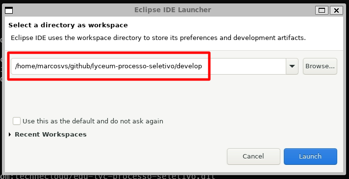
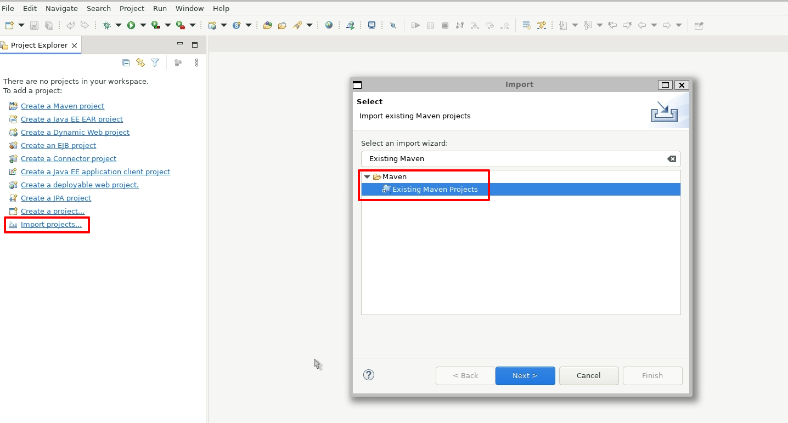

## :zap: Preparando edu-lyc-processo-seletivo

Depois da preparação do projeto **edu-lyc-api-soap**, estamos prontos para realizar a subida do projeto **edu-lyc-processo-seletivo**.

##### 2.1 - Clone o projeto edu-lyc-processo-seletivo

Entre no repostório [edu-lyc-processo-seletivo](https://github.com/technecloud/edu-lyc-processo-seletivo) e faça o clone do projeto a partir da branch develop. Lembre-se de clonar esse projeto na pasta `~/github/lyceum-processo-seletivo/develop` citada anteriormente.

##### 2.2 - Execute o build do projeto usando o Maven

Dentro do terminal, vá até o diretório onde você realizou o clone do projeto e execute o comando:
```
./mvnw clean install -U
```
Caso ocorra o seguinte erro durante a execução do comando:
\
Execute o comando abaixo e tente novamente:
```
chmod +x mvnw
```
Aguarde até que a build mostre a mensagem de sucesso. (*A primeira execução costuma demorar um pouco para ser completada*)

##### 2.3 - Abrindo o projeto no Eclipse

Abra seu eclipse, mas na seleção de *workspaces* lembre-se de selecionar a pasta `~/github/lyceum-processo-seletivo/develop`.



Durante a primeira execução, seu workspace virá vazio, realize a importação do projeto acessando `File > Import Project` e selecionando a opção **Existing Maven Projects**.



Logo após a importação, o Eclipse irá iniciar o processo de *build* do projeto. Aguarde até que a operação seja concluída. (Esta etapa pode demorar alguns minutos)


